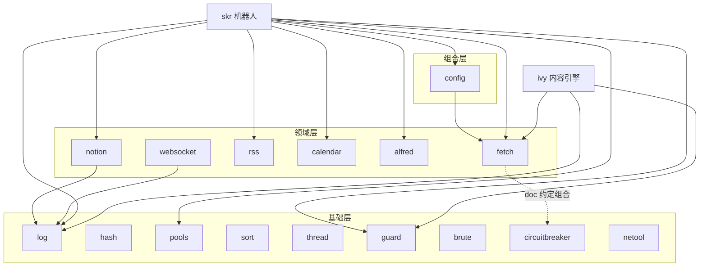

# ARCHITECTURE.md — tr1v3r/pkg 共享 Go 工具包集

> 一句话定位：一组零框架依赖（除少量标准生态库）的个人共享 Go 工具包，
> 为 skr（智能机器人）、ivy（内容构建引擎）等兄弟项目提供从日志、HTTP、
> 并发原语到 Notion/RSS/日历等领域客户端的统一底座。
>
> module path: `github.com/tr1v3r/pkg`，Go 1.24，16 个子包 / 111 个 go files。

---

## 1. 包目录总览

| 包 | 一句话职责 | 关键导出符号 | 被谁使用 |
|---|---|---|---|
| `log` | 结构化日志：多 Sink、异步写入、log↔slog 双向桥接 | `Setup` `Logger` `Sink` `Console` `File` `RotateFile` `AsSlogHandler` `SlogHandler` | skr、ivy、pkg 内部（notion/websocket） |
| `fetch` | 弹性 HTTP 客户端：重试、中间件、错误分类、响应限长 | `Get/CtxGet/Post/CtxPost/Patch/CtxPatch` `DoRequestWithOptions` `WithRetry` `RetryConfig` `HTTPError` `RetryableError` `Middleware` | skr、ivy、pkg 内部（config） |
| `notion` | Notion API 类型安全客户端：六大域 Manager + 限流 + 自动分页 | `Client` `NewClient` `DatabaseAPI` `PageAPI` `QueryIter` `Condition` `FilterCondition` `APIError` | skr、pkg 内部（依赖 log） |
| `pools` | 轻量 goroutine 池（WaitGroup 语义封装） | `Pool` `NewPool` | skr |
| `alfred` | Alfred Workflow JSON 输出构建器 | `WorkFlow` `NewWorkFlow` `FlowItem` `ModifierKey` | skr |
| `rss` | RSS / Atom / JSON Feed / OPML 解析 | `Parse` `ParseRSS` `ParseAtom` `ParseJSONFeed` `DetectFeedType` `ParseTyped` | skr |
| `guard` | 进程级信号守卫：全局取消 Context + panic 栈捕获 | `InspectShutSignal` `Cancel` `Cancelled` `Context` `Stop` `CatchStack` | skr、ivy |
| `config` | 配置加载：文件/URL/env → struct，JSON/YAML 可换 parser | `Configure` `NewConfigure` `Parser` `LoadTo` `LoadFromTo` | skr、pkg 内部（依赖 fetch） |
| `calendar` | iCalendar(.ics) 解析与生成（事件/时区/告警/RRULE） | `Parse` `ParseReader` `Calendar` `Event` `NewDate` `EscapeText` | skr |
| `circuitbreaker` | 经典三态熔断器（Closed→Open→HalfOpen） | `CircuitBreaker` `New` `Config` `DefaultConfig` `Execute` `State` `ErrOpen` | 独立使用（与 fetch 在调用点组合） |
| `netool` | 网络诊断：自定义 DNS 解析 + ICMP 延迟探测 | `LookupIP` `LookupWithServer` `ICMPDelay` `SingleICMPDelay` | — |
| `hash` | 常用摘要算法一键计算（MD5/SHA1/SHA2/SHA3 全系） | `CalcMD5` `CalcSHA256` `CalcSHA3_512` … | — |
| `brute` | 泛型回溯搜索引擎（BFS/DFS 框架） | `Bruter` `NewBruter` `Step` `State` `Queue` | — |
| `sort` | 泛型排序：单键/多键/反转比较器 | `By` `ReverseBy` `MultiBy` | — |
| `thread` | 带超时语义的 worker 池（Job 级 deadline） | `TimeoutPool` `NewTimeoutPool` `Job` `Submit` `StartAndWait` | — |
| `websocket` | gorilla/websocket + gin 的服务端/客户端封装（channel 读模式） | `WSHanlder` `ConnectWebsocket` `Read` `Write` `Close` | pkg 内部（依赖 log） |

注：`netool`/`hash`/`brute`/`sort`/`thread` 目前未发现兄弟仓库引用，属于"个人兵器库"型资产（见 §6 取舍）。

---

## 2. 分层结构与依赖图

三层划分（按依赖方向与抽象级别）：

- **基础层**（无内部依赖，只依赖标准库/少数第三方）：
  `log`、`hash`、`pools`、`sort`、`thread`、`guard`、`brute`、`circuitbreaker`、`netool`
- **领域层**（面向具体协议/服务）：
  `fetch`、`notion`、`rss`、`calendar`、`alfred`、`websocket`
- **组合层**（把基础/领域能力拼装成更高层抽象）：
  `config`（用 fetch 拉远程配置）



要点：

- 包间耦合极低：仅 3 条真实 import 边（`config→fetch`、`notion→log`、`websocket→log`）。
- `fetch` 与 `circuitbreaker` **刻意不互相 import**（`fetch/doc.go` 明确写着
  "For circuit breaker functionality, see the circuitbreaker package"），
  组合发生在调用点：`cb.Execute(func() error { _, err := fetch.Get(url); return err })`。
  〔推断〕这是为了让两者可独立使用、避免循环演化。

---

## 3. 包 → 消费方反向索引

对兄弟仓库 `skr`、`ivy`、`stream` 的 import 语句统计（按 import 次数）：

| pkg 子包 | skr | ivy | stream | 合计（引用仓库数） |
|---|---|---|---|---|
| `log` | 40 | 3 | 0 | **2** |
| `fetch` | 17 | 2 | 0 | **2** |
| `guard` | 1 | 2 | 0 | **2** |
| `notion` | 7 | 0 | 0 | 1 |
| `pools` | 5 | 0 | 0 | 1 |
| `alfred` | 5 | 0 | 0 | 1 |
| `rss` | 4 | 0 | 0 | 1 |
| `config` | 2 | 0 | 0 | 1 |
| `calendar` | 2 | 0 | 0 | 1 |
| `circuitbreaker` `netool` `hash` `brute` `sort` `thread` `websocket` | 0 | 0 | 0 | 0（仅 pkg 内部/备用） |

**被引用最多的 3 个包：`log`（43 次 import）> `fetch`（19）> `notion`（7）** —— 与
"每个 Go 程序都需要日志和 HTTP"的直觉一致，是本仓库的核心资产。
`stream` 虽是 Go module（`github.com/tr1v3r/stream`，go 1.26）但未引用任何 pkg 子包。

---

## 4. 重点包深写

### 4.1 `log` — 引用最多的基座

**设计要点**

- 核心三元组：`Logger`（API 门面）→ `Record`（结构化记录 + `Field` 强类型字段）→ `Sink`（输出目标）。
- 一个 `Logger` 可挂多个 `Sink`（`Setup(sinks ...*Sink)`），每个 Sink 独立 `Level` 与同步/异步模式
  （`WithLevel`、`WithAsync(bufSize)`、`WithSync`）——典型用法是 console 用同步低级别、
  文件用异步高级别。
- 编码器多态：`text`（彩色控制台）、`json`（结构化）、`slog` 桥接；`RotateFile(dir, prefix, rotation)`
  提供按尺寸/时间轮转。
- **双向 slog 桥接**是最大亮点：`AsSlogHandler(sink)` 让本包 Sink 当 `slog.Handler` 用，
  `SlogHandler(h)` 反向把任意 `slog.Handler` 包成 Sink——存量 slog 生态可直接接入。
- API 双形态：全局函数（`log.Info/Infof/...`，包级 `globalLogger`）与实例方法
  （`l := log.New(sinks...)`），`With(args...)` 派生带上下文字段的子 Logger。
- context 感知：`CtxInfo(ctx, ...)` 家族从 ctx 提取 trace 类字段。

**并发模型**：异步 Sink 内部 buffered channel + 后台 writer goroutine；`Sync()`/`Close()`
负责刷盘，`Fatal` 打完日志后 `os.Exit`。全局 `SetLevel` 线程安全。

**典型用法**（改写自 skr `cmd/command/daemon.go`）：

```go
fileSink, err := log.RotateFile(logDir, prefix, rotation, log.WithLevel(log.InfoLevel))
if err != nil { return err }
log.Setup(log.Console(), fileSink) // 控制台 + 轮转文件双写
defer log.Close()
```

### 4.2 `fetch` — 弹性 HTTP 客户端

**设计要点**

- 包级共享 `http.Client`（连接池参数收敛：MaxConnsPerHost=10、强制 TLS≥1.2、ProxyFromEnvironment），
  `DefaultClient()`/`SetDefaultClient()` 用 `sync.RWMutex` 保护可热替换；
  `NewInsecureClient()` 提供 skip-TLS-verify 逃生门。
- 两级 API：便捷函数（`Get/Post/Patch` + `Ctx*` 带 context 变体，返回 `[]byte`）
  与底层（`DoRequestWithOptions` 返回 `statusCode, content, header, err` 三件套）。
- **函数式选项全走 `RequestOption`**（改 `*http.Request`），选项同时也是 context 值的载体：
  `WithTimeout` 把 cancel 函数塞进 ctx（请求结束自动调用，防泄漏）、
  `WithMaxResponseBodySize` 用 ctx 值传递（默认 100MB，-1 不限制）、
  `WithMiddleware` 通过 ctx 累积中间件链。

**重试模型**（retry.go）：`RetryConfig{MaxAttempts, BaseDelay, MaxDelay, Jitter}` +
指数退避；尊重服务端 `Retry-After` 头；只重试可重试错误（网络错误 / 5xx / 429，
见 `IsRetryableStatusCode`）。`WithRetry(ctx, config, fn)` 是通用包装器，不绑定 HTTP。

**中间件**（middleware.go）：`Middleware` 是"包裹执行函数"的装饰器签名，
`ChainMiddleware` 串联；内置 `WithLogging`（接 `RequestLogger` 接口）、
`WithMetrics`、`WithRequestTimeout`。可与第三方观测系统对接而不引入硬依赖。

**错误处理**：结构化错误类型而非字符串——`HTTPError{StatusCode, Body, URL}` 保留响应体，
`RetryableError{Err, Attempts}` 实现 `Unwrap()`，调用方可用
`errors.As` / 类型断言精确分支（测试 `TestErrorTypeAssertions` 覆盖）。

**典型用法**（改写自 skr `internal/service/rule/stocks.go` 与 fetch 测试）：

```go
// 简单 GET + 错误分类
data, err := fetch.Get(url)
var httpErr *fetch.HTTPError
if errors.As(err, &httpErr) && fetch.IsServerError(httpErr.StatusCode) {
    return fmt.Errorf("upstream %d: %w", httpErr.StatusCode, err)
}

// 重试 + 中间件
status, body, _, err := fetch.WithRetry(ctx, fetch.NewRetryConfig(
    fetch.WithMaxAttempts(3), fetch.WithBaseDelay(100*time.Millisecond),
), func() (int, []byte, http.Header, error) {
    return fetch.DoRequestWithOptions("GET", url,
        []fetch.RequestOption{fetch.WithContentTypeJSON(), fetch.WithUserAgent("skr")}, nil)
})
```

### 4.3 `notion` — Notion API 客户端

**设计要点**

- `Client`（manager.go）聚合六个域 Manager：`Database` `Page` `Block` `User` `Search` `Comment`，
  各自实现 `interfaces.go` 里的 `DatabaseAPI`/`PageAPI`/… 接口——接口先行，便于 mock
  （`mock_test.go` 全套 fake）。
- **内置限流**：默认 `rate.NewLimiter(rateLimit, 4*rateLimit)`（令牌桶），可用
  `WithRateLimiter(limiter)` 替换；所有请求过 `Client` 统一收口。
- **自动分页**：`Query` 一次拉全；`QueryIter(ctx, id, cond) iter.Seq2[Page, error]`
  （Go 1.23 range-over-func）按需惰性取下一批——大库导出场景不爆内存。
- 类型系统完整映射 Notion 对象模型（object.go/property.go）：`Property` 带
  `ForUpdate()`（生成仅含可写字段的 JSON）、`PlainText()`、`GetRelationIDs()` 等
  便捷方法；filter.go 为每种属性提供 Filter 类型，`Condition` 组合 filter+sorts。
- 错误：`APIError` 携带 Notion 返回的 code/message；所有方法首参 `context.Context`。

**并发模型**：Client 本身无锁（Manager 只读构造）；并发由调用方用 `pools` 控制——
skr 的实践是 `pools.NewPool(12)` + 每协程调 `mgr.Database.Query`，限流器天然跨协程生效。

**典型用法**（改写自 notion/doc.go 与 skr `internal/service/notion`）：

```go
mgr := notion.NewClient("2022-06-28", token)
pages, err := mgr.Database.Query(ctx, dbID, &notion.Condition{
    Filter: &notion.FilterCondition{
        FilterSingleCondition: notion.FilterSingleCondition{
            Property: "Status", Status: &notion.StatusFilter{Equals: "Done"},
        },
    },
    Sorts: []notion.PropSortCondition{{Property: "Created", Direction: "descending"}},
})
// 惰性迭代
for page, err := range mgr.Database.QueryIter(ctx, dbID, cond) {
    if err != nil { return err }
    _ = page
}
```

### 4.4 `circuitbreaker` — 三态熔断器

**设计要点**

- 单文件实现完整三态机：`StateClosed`（计数失败）→ 达 `FailureThreshold` 进
  `StateOpen`（fast-fail `ErrOpen`）→ `OpenTimeout` 后转 `StateHalfOpen`（放探针）→
  连续 `SuccessThreshold` 成功回 Closed。`DefaultConfig = {5, 3, 30s}`。
- **粗粒度 `sync.Mutex`** 而非原子操作：状态迁移涉及多字段（state/count/lastFailure）
  的一致性，锁语义最直白；代价是高并发下 Allow() 串行化——〔推断〕个人项目规模下
  该取舍正确，未做分片优化。
- 错误可区分：哨兵 `ErrOpen` + `Error{Err}` 包装（带 `Unwrap`），调用方可用
  `errors.Is(err, circuitbreaker.ErrOpen)` 识别"被熔断"与"业务失败"。
- 不含重试、不含 HTTP——纯保护原语（见 §2 组合约定）。

**典型用法**（fetch/doc.go 与 concurrency_test.go）：

```go
cb := circuitbreaker.New(circuitbreaker.DefaultConfig)
err := cb.Execute(func() error {
    _, err := fetch.Get(url)
    return err
})
if errors.Is(err, circuitbreaker.ErrOpen) { /* fast-fail 降级路径 */ }
```

---

## 5. 横切约定一致性审计

| 维度 | 约定 | 一致性 |
|---|---|---|
| context 传递 | 领域层公开 API 一律 `ctx` 首参（notion 全接口、fetch `Ctx*`、websocket `ConnectWebsocket`）；基础层（hash/pools/sort）不需要 ctx | ✅ 良好；fetch 的非 Ctx 便捷函数是显式补充而非缺口 |
| 错误处理 | 关键包用结构化错误 + `Unwrap`（fetch `HTTPError/RetryableError`、circuitbreaker `Error/ErrOpen`、notion `APIError`）；简单包直接返回 error | ✅ 分层合理：复杂度高的包抽象错误，简单包不过度设计 |
| 日志接入 | 只有 notion、websocket 内部调 pkg/log（错误路径 debug）；fetch 不直接依赖 log，而是暴露 `RequestLogger` 接口由调用方注入 | ✅ 刻意解耦，避免 fetch 被 log 绑死〔接口注入是优于硬连线的模式〕 |
| 并发原语 | 池类三件套各司其职：`pools`（WaitGroup 语义）、`thread`（Job 超时 + 终止语义）、circuitbreaker（互斥状态机） | ✅ 无重叠职责 |
| 全局状态 | `fetch` 的包级 client、`log` 的 globalLogger、`guard` 的包级 ctx——均提供置换/查询 API 且线程安全 | ✅ |
| 泛型 | Go 1.18+ 泛型用在刀刃上：`brute`（`Bruter[S State]`）、`sort`（`By[T]`）、`rss`（`ParseTyped[T]`） | ✅ |

不一致点（轻微）：`fetch.WithRetry` 的 `RetryConfig` 选项名（`WithMaxAttempts`）与
请求选项（`RequestOption`）命名空间同在 fetch 包内，`With` 前缀重载靠签名区分；
新使用者偶有混淆可能。

---

## 6. 设计决策与取舍（含推断标注）

1. **〔推断〕单 module 多包而非多 module**：16 个子包共居一个 module，兄弟仓库
   `replace` 或直接 require 一次即可用全部工具；代价是依赖树合并（gin/miekg-dns 等
   重依赖只被少数包使用，消费方仍需拉全 go.sum）。
2. **熔断与重试不内建进 fetch**：fetch 文档明确指引调用点组合。推断动机：保持
   fetch 可单独编译进最小依赖场景，且组合策略（先熔断后重试/反之）因场景而异。
3. **`pools` 与 `thread` 并存**：pools 是"等待一批任务完成"的最薄封装（skr 高频用），
   thread 解决"Job 级超时 + 优雅终止 + worker 复用"的完整生命周期——推断为不同时期、
   不同复杂度的两次抽象，尚未合并。
4. **log 自研而非直接用 slog**：包同时提供 slog 双向桥（`AsSlogHandler`/`SlogHandler`），
   推断意图是保留自有 Sink/轮转/异步模型的同时兼容标准生态，而非替代。
5. **notion 接口驱动 + mock 全覆盖**：`interfaces.go` 六接口 + `mock_test.go`，
   推断服务于 skr 的可测试性（业务层依赖接口而非具体 Client）。
6. **`config` 依赖 `fetch` 拉远程配置**：组合层的存在理由——支持 `LoadTo(v, "https://...")`
   直接从 URL 读配置；parser 以 `Parser = func(any, []byte) error` 函数类型开放，
   JSON 默认、YAML 可选。
7. **0 引用包的去留**：`netool/hash/brute/sort/thread` 无外部消费者，属算法练习 +
   备用兵器；〔推断〕保留成本低（无内部依赖边），暂不拆分。

---

## 7. 质量自检记录（终稿前核验）

- ✅ 全部子包目录名、导出符号经 `grep -rn '^func [A-Z]|^type [A-Z]'` 逐包核对
  （如 `fetch.WithContentTypeJSON` 为 `var` 型选项函数，位于 option.go，真实存在）。
- ✅ 内部依赖边经 `grep -rn 'tr1v3r/pkg'` 全仓扫描：仅 config→fetch、notion→log、websocket→log。
- ✅ 消费方数据经对 skr/ivy/stream 的 import 全量统计（stream 为 Go module 但 0 引用）。
- ✅ 用法示例改写自真实代码：skr `cmd/command/daemon.go`（log）、
  `internal/service/rule/stocks.go`（fetch）、notion/doc.go + skr notion 服务层、
  fetch/doc.go（circuitbreaker）。
